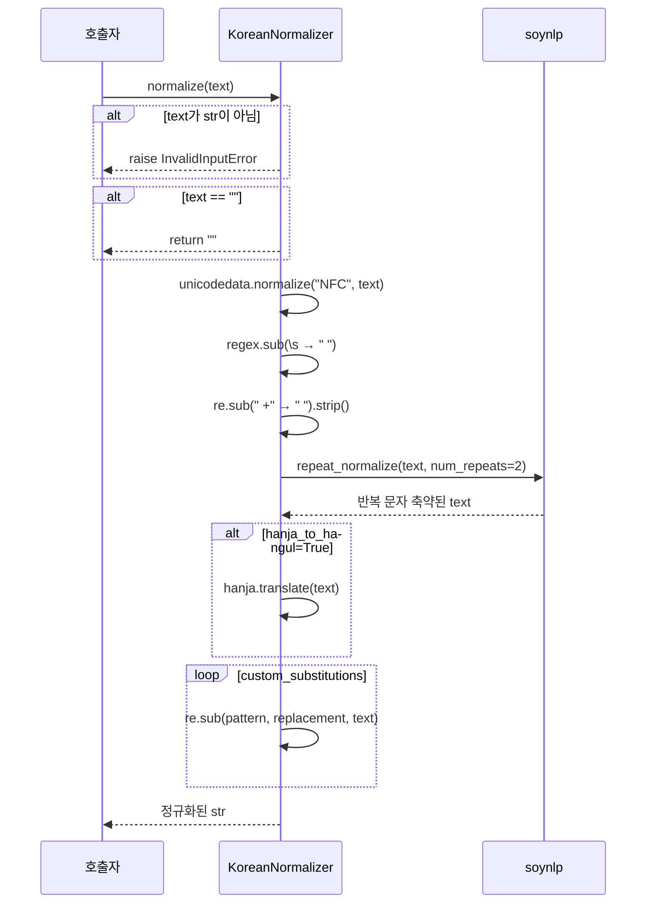
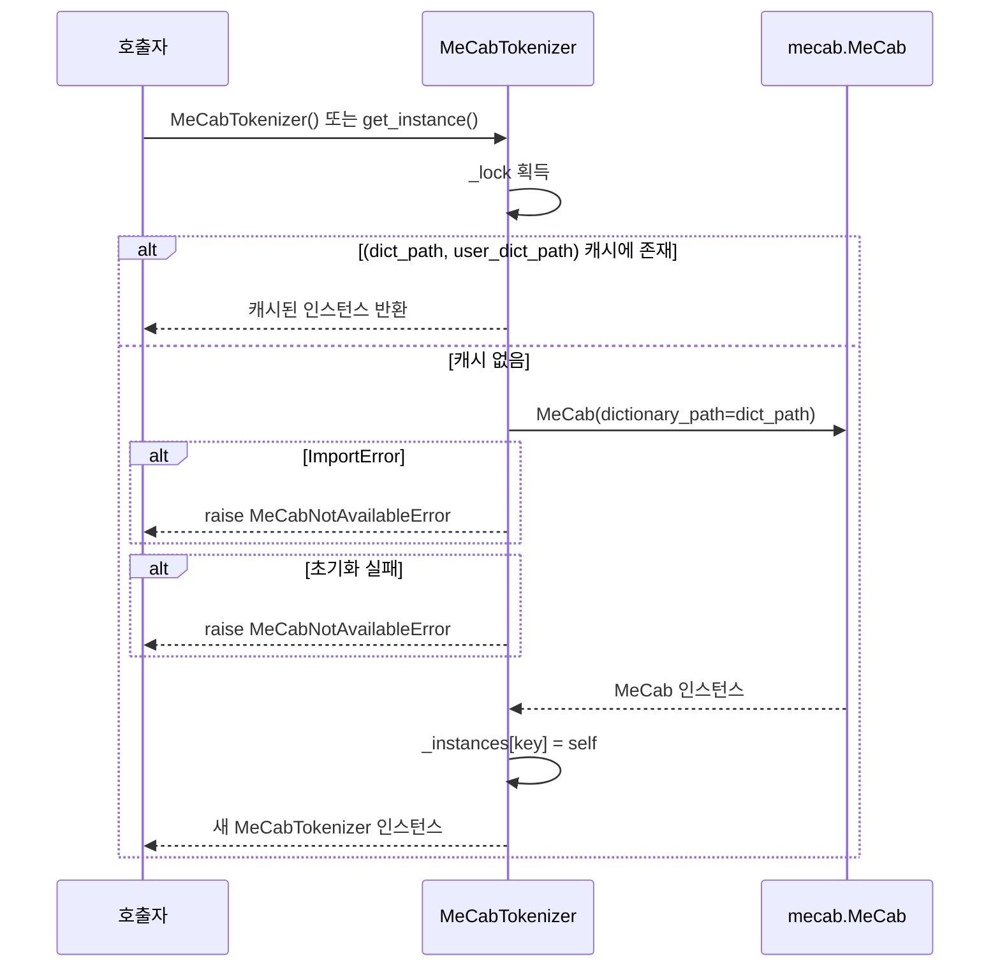
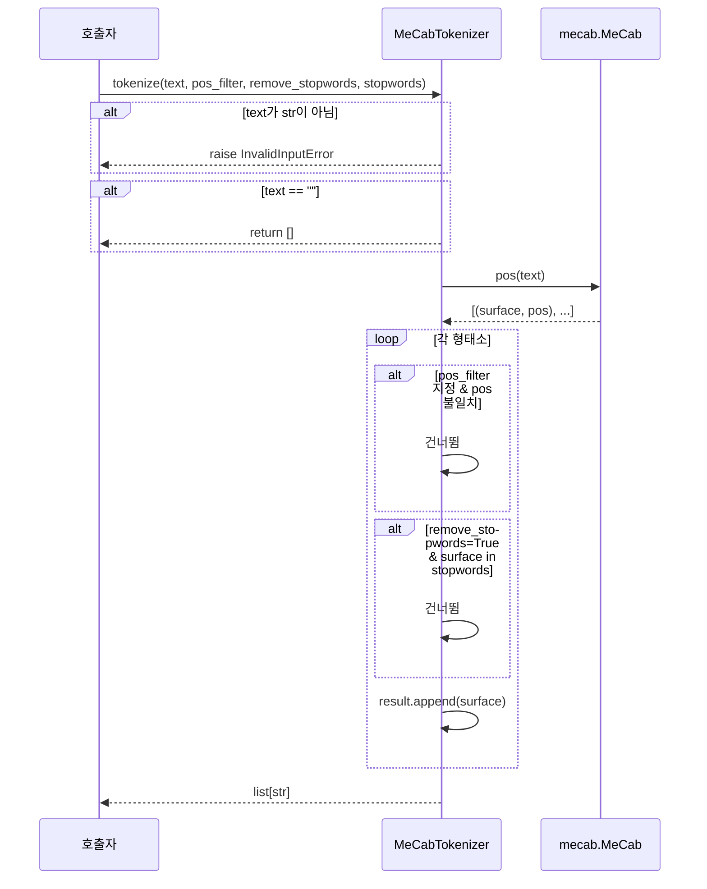
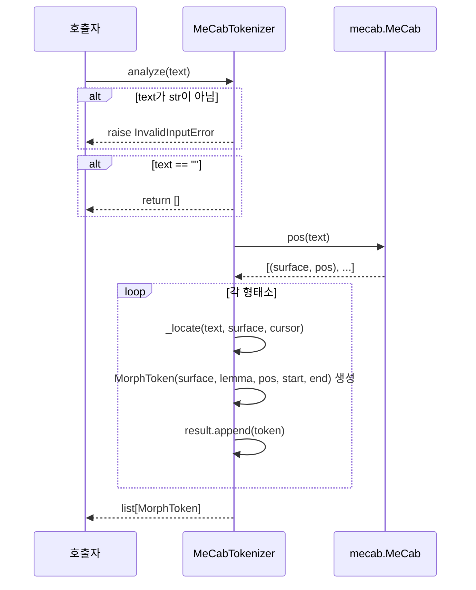
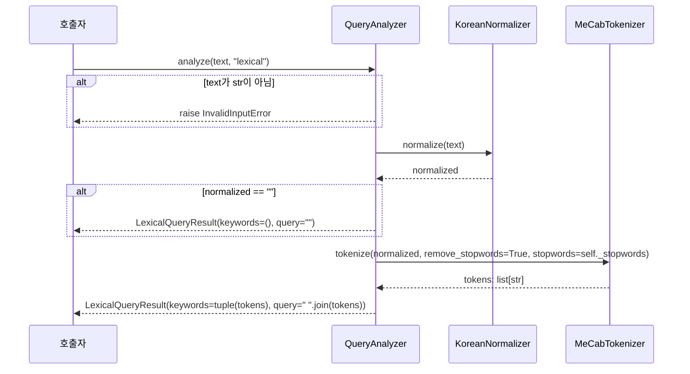
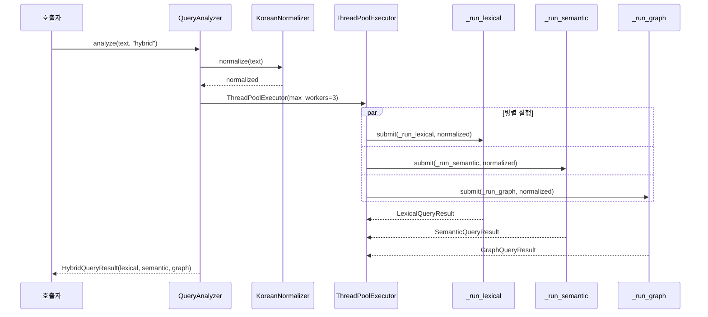
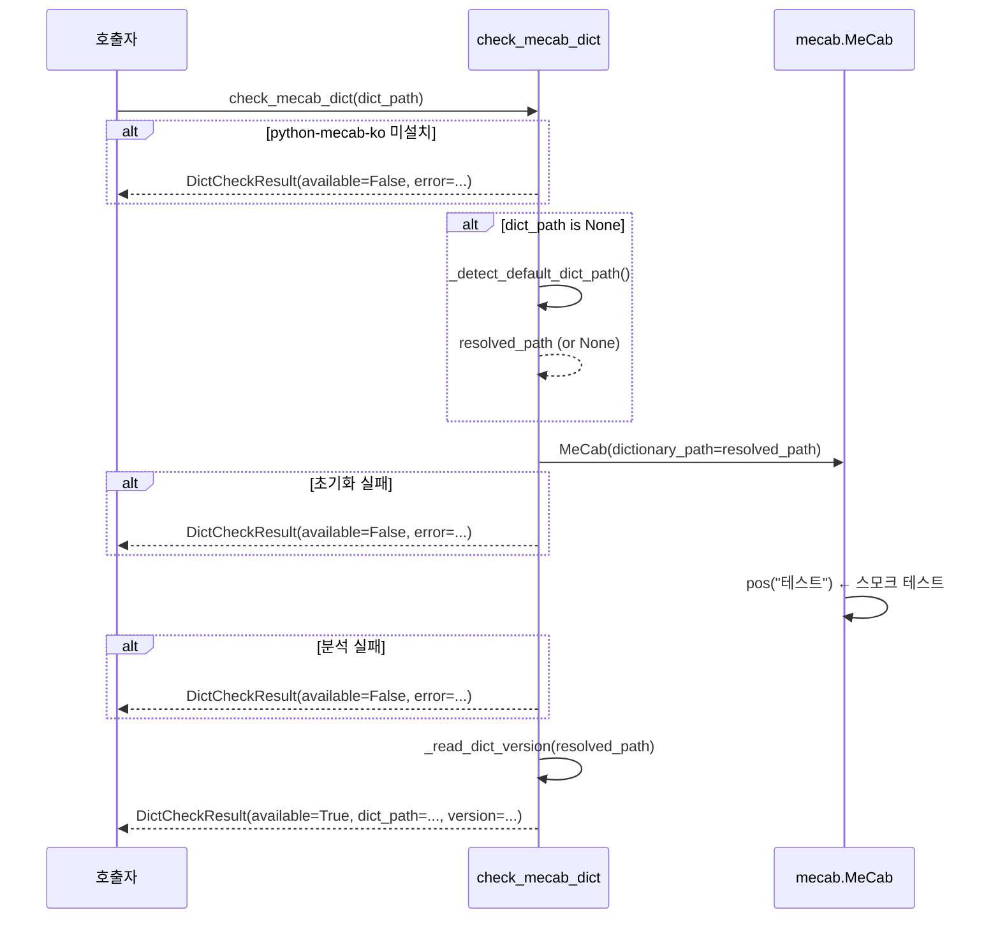

# SPEC.md — bpmg-korean-nlp 기능 명세

## 목차

1. [개요](#1-개요)
2. [모듈 구조](#2-모듈-구조)
3. [기능 명세](#3-기능-명세)
   - 3.1 [KoreanNormalizer — 텍스트 정규화](#31-koreannormalizer--텍스트-정규화)
   - 3.2 [MeCabTokenizer — 형태소 분석](#32-mecabtokenizer--형태소-분석)
   - 3.3 [QueryAnalyzer — 쿼리 변환](#33-queryanalyzer--쿼리-변환)
   - 3.4 [JamoUtils — 한글 자모 유틸리티](#34-jamoutils--한글-자모-유틸리티)
   - 3.5 [Stopwords — 불용어 집합](#35-stopwords--불용어-집합)
   - 3.6 [PII — 개인정보 패턴 데이터](#36-pii--개인정보-패턴-데이터)
   - 3.7 [MeCab 사전 점검](#37-mecab-사전-점검)
4. [데이터 모델](#4-데이터-모델)
5. [예외 계층](#5-예외-계층)
6. [설계 제약](#6-설계-제약)
7. [클래스 다이어그램](#7-클래스-다이어그램)
8. [시퀀스 다이어그램](#8-시퀀스-다이어그램)

---

## 1. 개요

`bpmg-korean-nlp`는 한국어 입력을 처리하는 시스템이 공통으로 사용하는 NLP 전처리 Python SDK입니다.

- **역할**: normalize / tokenize / analyze / query transform
- **비역할**: BM25 실행, 벡터 임베딩, 그래프 순회, 랭킹, PII 탐지·치환
- **1차 소비자**: `retrieval-engine`의 한국어 토크나이저 어댑터
- **Python**: 3.12 이상
- **패키지 레이아웃**: `src/bpmg_korean_nlp/` (PEP 517/518 src layout)

---

## 2. 모듈 구조

```
src/bpmg_korean_nlp/
├── __init__.py          # 공개 API 29개 심볼 재수출
├── enums.py             # QueryTarget, CharType
├── exceptions.py        # KoreanNlpError 계층
├── models.py            # frozen dataclass 데이터 모델 8종
├── normalizer.py        # KoreanNormalizer
├── tokenizer.py         # MeCabTokenizer (mecab-ko-dic 싱글톤)
├── query_analyzer.py    # QueryAnalyzer, analyze_query()
├── jamo_utils.py        # decompose / compose / extract_choseong / classify_char
├── stopwords.py         # DEFAULT_STOPWORDS, merge_stopwords()
├── pii.py               # PII_PATTERNS, check_pii() (내부 차단 함수)
└── mecab_check.py       # check_mecab_dict()
```

---

## 3. 기능 명세

### 3.1 KoreanNormalizer — 텍스트 정규화

**클래스**: `KoreanNormalizer`  
**파일**: `normalizer.py`

#### 정규화 파이프라인 (고정 순서)

| 단계 | 처리 내용 | 비고 |
|---|---|---|
| 1 | **NFC 정규화** | 항상 ON, 변경 불가 |
| 2 | 유니코드 공백 → ASCII 공백 | `\xa0`, `　`, ` ` 등 전부 치환 |
| 3 | 연속 공백 → 단일 공백 + strip | |
| 4 | **반복 문자 축약** | `soynlp.repeat_normalize(num_repeats=2)` |
| 5 | 한자 → 한글 발음 변환 | 기본 OFF, `hanja_to_hangul=True` 시 활성화 |
| 6 | 사용자 정의 치환 | `custom_substitutions` 리스트 순서대로 `re.sub` |
| 7 | 노이즈 제거 | `strip_noise=True` 시 구두점·기호·이모지·자모 감탄사 제거 |

#### 생성 방법

```python
# 잠금 기본값 (권장)
norm = KoreanNormalizer.default()

# 옵션 지정
norm = KoreanNormalizer(
    hanja_to_hangul=True,
    custom_substitutions=[("ㅋㅋ", "웃음")]
)
```

#### 불변 기본값

| 옵션 | 기본값 | 변경 가능 여부 |
|---|---|---|
| NFC | ON | 변경 불가 (잠금) |
| 반복 문자 축약 | ON | 변경 불가 (잠금) |
| hanja_to_hangul | OFF | 인스턴스 생성 시 변경 가능 |
| custom_substitutions | 없음 | 인스턴스 생성 시 변경 가능 |
| strip_noise | OFF | 인스턴스 생성 시 변경 가능 |

#### 입출력 규약

| 입력 | 출력 |
|---|---|
| `str` | 정규화된 `str` |
| `""` (빈 문자열) | `""` |
| `None` / 비문자열 | `InvalidInputError` |

---

### 3.2 MeCabTokenizer — 형태소 분석

**클래스**: `MeCabTokenizer`  
**파일**: `tokenizer.py`  
**의존**: `python-mecab-ko`, `mecab-ko-dic`

#### 싱글톤 정책

- `(dict_path, user_dict_path)` 키로 프로세스 내 캐시
- `MeCabTokenizer()` 와 `MeCabTokenizer.get_instance()` 는 동일 객체 반환
- 사전 로딩 비용(수백 ms, 수십 MB)을 최초 1회만 지불

#### 메서드

**`tokenize(text, pos_filter, remove_stopwords, stopwords) → list[str]`**

BM25 인덱싱용 토큰 배열을 반환합니다.

| 파라미터 | 타입 | 기본값 | 설명 |
|---|---|---|---|
| `text` | `str` | 필수 | 분석 대상 문자열 |
| `pos_filter` | `frozenset[str] \| None` | `None` | 지정 시 해당 POS 태그만 통과 |
| `remove_stopwords` | `bool` | `False` | `True`이면 불용어 제거 |
| `stopwords` | `frozenset[str] \| None` | `None` | 커스텀 불용어 (미지정 시 `DEFAULT_STOPWORDS`) |

**`analyze(text) → list[MorphToken]`**

형태소·품사·원문 내 오프셋을 포함한 풍부한 분석 결과를 반환합니다.

#### 주요 POS 태그 (세종 품사 체계)

| 태그 | 의미 |
|---|---|
| `NNG` | 일반명사 |
| `NNP` | 고유명사 |
| `VV` | 동사 |
| `VA` | 형용사 |
| `JKS`, `JKO`, `JKB` | 주격·목적격·부사격 조사 |
| `JX` | 보조사 |
| `SL` | 외국어 |
| `SN` | 숫자 |

---

### 3.3 QueryAnalyzer — 쿼리 변환

**클래스**: `QueryAnalyzer`  
**함수**: `analyze_query()`  
**파일**: `query_analyzer.py`

#### 4가지 검색 타깃

| 타깃 | 열거값 | 출력 타입 | 설명 |
|---|---|---|---|
| LEXICAL | `QueryTarget.LEXICAL` | `LexicalQueryResult` | 토크나이징 + 불용어 제거 → BM25용 |
| SEMANTIC | `QueryTarget.SEMANTIC` | `SemanticQueryResult` | 정규화된 원문 보존 → 임베딩 모델용 |
| GRAPH | `QueryTarget.GRAPH` | `GraphQueryResult` | NNG·NNP 명사 추출 → 그래프 시드 노드용 |
| HYBRID | `QueryTarget.HYBRID` | `HybridQueryResult` | 세 파이프라인 병렬 실행 후 묶음 반환 |

#### 공통 전처리

모든 타깃은 `analyze()` 진입 후 동일한 전처리를 공유합니다.

```
입력 → normalize() → 타깃별 처리 (LEXICAL: NNG/NNP/NNB/SL/SN/XR POS 필터 + 불용어 제거)
```

#### HYBRID 병렬 처리

`ThreadPoolExecutor(max_workers=3)` 으로 LEXICAL·SEMANTIC·GRAPH를 동시 실행합니다.

#### DI (의존성 주입) 지원

```python
# 기본
qa = QueryAnalyzer()

# DI 주입 예시 (테스트용)
qa = QueryAnalyzer(normalizer=custom_normalizer, tokenizer=custom_tokenizer)
```

#### `analyze_query()` 편의 함수

```python
from bpmg_korean_nlp import analyze_query, QueryTarget

result = analyze_query("세종대학교 도서관 위치", QueryTarget.LEXICAL)
```

모듈 레벨 기본 인스턴스를 재사용하므로 반복 호출 시 사전·모델 로딩 비용이 없습니다.

#### 타깃 문자열 허용 (대소문자 무관)

```python
qa.analyze("쿼리", "lexical")   # OK
qa.analyze("쿼리", "LEXICAL")   # OK
qa.analyze("쿼리", "Lexical")   # OK
```

---

### 3.4 JamoUtils — 한글 자모 유틸리티

**파일**: `jamo_utils.py`  
모든 함수는 모듈 수준 순수 함수입니다.

#### `decompose(char) → JamoComponents`

한글 음절 1자를 초성·중성·종성으로 분리합니다.

- 입력: 한글 음절 단일 문자 (`U+AC00`–`U+D7A3`)
- 종성 없는 음절의 `jongseong` 필드는 `""`
- 비한글·다중문자 입력 → `InvalidInputError`

#### `compose(choseong, jungseong, jongseong="") → str`

초성·중성·종성 자모를 합성하여 음절 1자를 반환합니다.

- 왕복 보장: `compose(*decompose(c)) == c` (전 음절 범위)
- 유효하지 않은 자모 → `InvalidInputError`

#### `extract_choseong(text) → str`

문자열 내 한글 음절을 초성으로 대체합니다. 비한글 문자는 그대로 유지합니다.

```python
extract_choseong("안녕하세요")  # → "ㅇㄴㅎㅅㅇ"
extract_choseong("한국 NLP")   # → "ㅎㄱ NLP"
```

#### `classify_char(char) → CharType`

단일 문자의 종류를 분류합니다.

| `CharType` 값 | 대상 |
|---|---|
| `HANGUL_SYLLABLE` | `U+AC00`–`U+D7A3` 완성형 한글 |
| `HANGUL_JAMO` | 한글 자모 블록 |
| `HANJA` | CJK 한자 블록 |
| `LATIN` | ASCII 영문자 + 라틴 확장 |
| `NUMBER` | ASCII 숫자 `0`–`9` |
| `WHITESPACE` | 공백·탭·개행 |
| `SYMBOL` | 기호·구두점 |
| `OTHER` | 위에 해당하지 않는 나머지 |

---

### 3.5 Stopwords — 불용어 집합

**상수**: `DEFAULT_STOPWORDS: frozenset[str]`  
**함수**: `merge_stopwords(*additional, base=None) → frozenset[str]`  
**파일**: `stopwords.py`

- 규모: 155어 (조사·접속사·부사·지시어·수사 등)
- 도메인 특화 단어("교재", "수업" 등) 미포함
- `frozenset` → 변경 시도 시 `AttributeError`
- 원본을 변경하지 않고 새 집합을 반환하는 `merge_stopwords()` 사용

---

### 3.6 PII — 2차 차단 필터

**상수**: `PII_PATTERNS: tuple[PIIPattern, ...]`  
**내부 함수**: `check_pii(text)` — `QueryAnalyzer.analyze()` 내부에서 자동 호출  
**파일**: `pii.py`

| 이름 | 설명 | 패턴 예시 |
|---|---|---|
| `resident_id` | 주민등록번호 | `900101-1234567` |
| `mobile_phone` | 휴대전화 번호 | `010-1234-5678` |
| `business_id` | 사업자등록번호 | `123-45-67890` |
| `foreign_id` | 외국인등록번호 | `900101-5234567` |

`guardrail-core` 1차 필터 이후 2차 방어선. `QueryAnalyzer.analyze()` 진입 시 자동 검사하며,
패턴 감지 시 `PIIDetectedError`를 raise합니다. 런타임 마스킹·치환은 구현하지 않습니다.

---

### 3.7 MeCab 사전 점검

**함수**: `check_mecab_dict(dict_path=None) → DictCheckResult`  
**파일**: `mecab_check.py`

- `dict_path` 미지정 시 macOS·Ubuntu·Docker 표준 경로를 순서대로 탐색
- 성공·실패 모두 `DictCheckResult`로 반환 (예외 없음)
- CI 파이프라인 및 컨테이너 기동 직후 헬스체크 용도

---

## 4. 데이터 모델

모든 모델은 `@dataclass(frozen=True, slots=True)` 로 선언됩니다 — 불변·해시 가능·메모리 효율.

| 클래스 | 필드 | 생성 위치 |
|---|---|---|
| `MorphToken` | `surface`, `lemma`, `pos`, `start`, `end` | `MeCabTokenizer.analyze()` |
| `JamoComponents` | `choseong`, `jungseong`, `jongseong` | `decompose()` |
| `DictCheckResult` | `available`, `dict_path`, `version`, `error` | `check_mecab_dict()` |
| `PIIPattern` | `name`, `description`, `pattern` | `pii.py` 모듈 초기화 |
| `LexicalQueryResult` | `keywords`, `query` | `QueryAnalyzer` LEXICAL |
| `SemanticQueryResult` | `query` | `QueryAnalyzer` SEMANTIC |
| `GraphQueryResult` | `seed_nodes` | `QueryAnalyzer` GRAPH |
| `HybridQueryResult` | `lexical`, `semantic`, `graph` | `QueryAnalyzer` HYBRID |

`QueryResult` = `LexicalQueryResult | SemanticQueryResult | GraphQueryResult | HybridQueryResult`

---

## 5. 예외 계층

```
KoreanNlpError (base)
├── MeCabNotAvailableError   — MeCab 바인딩 또는 사전 로드 실패
├── InvalidInputError        — None / 비문자열 입력
└── PIIDetectedError         — QueryAnalyzer 2차 PII 차단. matched: list[str] 속성
```

모든 공개 함수는 비문자열 입력에 `InvalidInputError`를 발생시킵니다.  
빈 문자열(`""`)은 유효 입력이며 빈 결과를 반환합니다.

---

## 6. 설계 제약

### 금지 import

`retrieval_core`, `guardrail_core`, `chatbot_contracts`  
→ `scripts/check_imports.py` (AST 기반)로 CI에서 자동 차단

### 금지 구현

- BM25 실행 / 벡터 임베딩 / 그래프 순회 / 랭킹
- PII 런타임 탐지·치환·마스킹
- KoNLPy 기반 토크나이저
- 도메인 특화 불용어 기본 셋 추가

### 싱글톤 의무

`MeCabTokenizer` — 함수 호출마다 새 인스턴스 생성 금지

### 성능 기준

| 항목 | 기준 | 실측 |
|---|---|---|
| `tokenize()` p99 | < 5ms | 0.18ms |
| 1,000건 배치 | < 2,000ms | 151ms |

---

## 7. 클래스 다이어그램

```mermaid
classDiagram
    direction TB

    %% ── Enums ──────────────────────────────────────────
    class QueryTarget {
        <<enumeration>>
        LEXICAL
        SEMANTIC
        GRAPH
        HYBRID
    }

    class CharType {
        <<enumeration>>
        HANGUL_SYLLABLE
        HANGUL_JAMO
        HANJA
        LATIN
        NUMBER
        WHITESPACE
        SYMBOL
        OTHER
    }

    %% ── Exceptions ──────────────────────────────────────
    class KoreanNlpError {
        <<exception>>
    }
    class MeCabNotAvailableError {
        <<exception>>
    }
    class InvalidInputError {
        <<exception>>
    }
    KoreanNlpError <|-- MeCabNotAvailableError
    KoreanNlpError <|-- InvalidInputError

    %% ── Data Models ─────────────────────────────────────
    class MorphToken {
        <<dataclass frozen>>
        +str surface
        +str lemma
        +str pos
        +int start
        +int end
    }

    class JamoComponents {
        <<dataclass frozen>>
        +str choseong
        +str jungseong
        +str jongseong
    }

    class DictCheckResult {
        <<dataclass frozen>>
        +bool available
        +str dict_path
        +str version
        +str error
    }

    class PIIPattern {
        <<dataclass frozen>>
        +str name
        +str description
        +Pattern pattern
    }

    class LexicalQueryResult {
        <<dataclass frozen>>
        +tuple keywords
        +str query
    }

    class SemanticQueryResult {
        <<dataclass frozen>>
        +str query
    }

    class GraphQueryResult {
        <<dataclass frozen>>
        +tuple seed_nodes
    }

    class HybridQueryResult {
        <<dataclass frozen>>
        +LexicalQueryResult lexical
        +SemanticQueryResult semantic
        +GraphQueryResult graph
    }

    HybridQueryResult *-- LexicalQueryResult
    HybridQueryResult *-- SemanticQueryResult
    HybridQueryResult *-- GraphQueryResult

    %% ── Core Classes ─────────────────────────────────────
    class KoreanNormalizer {
        -bool _hanja_to_hangul
        -tuple _custom_substitutions
        +default()$ KoreanNormalizer
        +normalize(text) str
        -_convert_hanja(text) str
    }

    class MeCabTokenizer {
        -dict _instances$
        -Lock _lock$
        -Any _mecab
        -str _dict_path
        -str _user_dict_path
        +get_instance(dict_path, user_dict_path)$ MeCabTokenizer
        +reset_instances()$
        +tokenize(text, pos_filter, remove_stopwords, stopwords) list
        +analyze(text) list
        -_mecab_pos(text) list
        -_locate(text, surface, cursor) tuple
    }

    class QueryAnalyzer {
        -KoreanNormalizer _normalizer
        -MeCabTokenizer _tokenizer
        -frozenset _stopwords
        +analyze(text, target) QueryResult
        -_preprocess(text) str
        -_run_lexical(text) LexicalQueryResult
        -_run_semantic(text) SemanticQueryResult
        -_run_graph(text) GraphQueryResult
        -_run_hybrid(text) HybridQueryResult
        -_resolve_target(target)$ QueryTarget
    }

    %% ── Module-level functions ───────────────────────────
    class JamoUtils {
        <<module>>
        +decompose(char) JamoComponents
        +compose(cho, jung, jong) str
        +extract_choseong(text) str
        +classify_char(char) CharType
    }

    class StopwordsModule {
        <<module>>
        +DEFAULT_STOPWORDS frozenset
        +merge_stopwords(*additional, base) frozenset
    }

    class PIIModule {
        <<module>>
        +PII_PATTERNS tuple
        -check_pii(text) None
    }

    class MeCabCheckModule {
        <<module>>
        +check_mecab_dict(dict_path) DictCheckResult
    }

    %% ── Relationships ────────────────────────────────────
    QueryAnalyzer --> KoreanNormalizer : uses
    QueryAnalyzer --> MeCabTokenizer : uses
    QueryAnalyzer --> StopwordsModule : uses DEFAULT_STOPWORDS
    QueryAnalyzer ..> QueryTarget : dispatches on
    QueryAnalyzer ..> LexicalQueryResult : returns
    QueryAnalyzer ..> SemanticQueryResult : returns
    QueryAnalyzer ..> GraphQueryResult : returns
    QueryAnalyzer ..> HybridQueryResult : returns

    MeCabTokenizer ..> MorphToken : produces
    MeCabTokenizer ..> MeCabNotAvailableError : raises
    MeCabCheckModule ..> DictCheckResult : returns

    JamoUtils ..> JamoComponents : produces
    JamoUtils ..> CharType : returns
    PIIModule ..> PIIPattern : holds
    PIIModule ..> PIIDetectedError : raises

    QueryAnalyzer ..> PIIDetectedError : raises

    KoreanNormalizer ..> InvalidInputError : raises
    MeCabTokenizer ..> InvalidInputError : raises
```



---

## 8. 시퀀스 다이어그램

### 8.1 KoreanNormalizer.normalize()



---

### 8.2 MeCabTokenizer 싱글톤 초기화



---

### 8.3 MeCabTokenizer.tokenize()



---

### 8.4 MeCabTokenizer.analyze()



---

### 8.5 QueryAnalyzer.analyze() — LEXICAL



---

### 8.6 QueryAnalyzer.analyze() — HYBRID (병렬)



---

### 8.7 check_mecab_dict()


